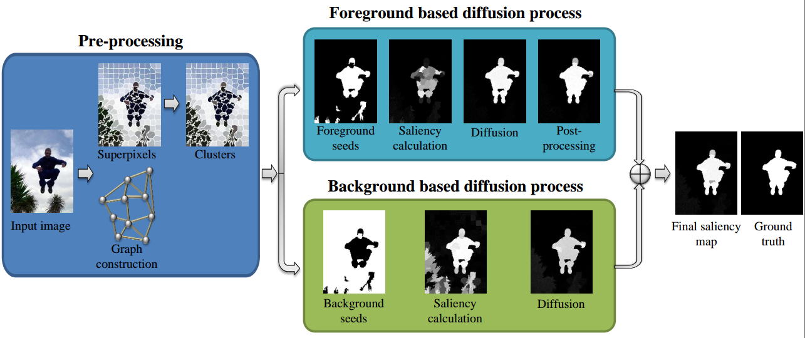
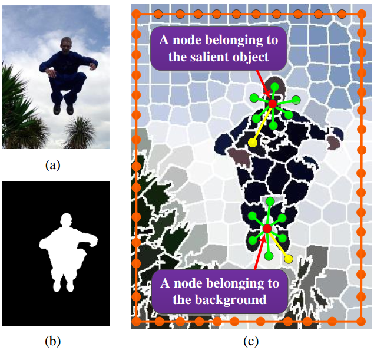
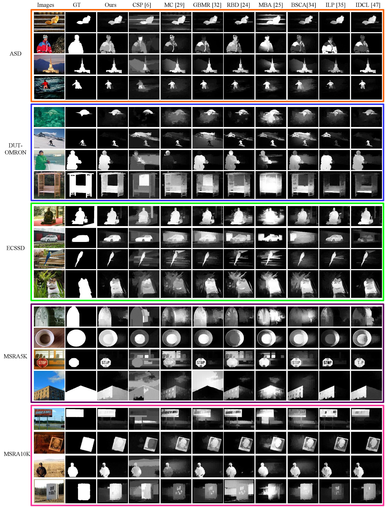

# MATLAB code for Salient Region Detection

This repository is an official Matlab implementation of the paper **"Salient Region Detection using Diffusion Process on a 2-Layer Sparse Graph"** 

## Summary


Main steps of the proposed salient region detection algorithm on an example image.



The 2-layer sparse graph model. (a) Input image. (b) Ground truth. (c) Edge connection between nodes. A node (illustrated by a red dot) connects to both its adjacent nodes (green dot and connection) and the most similar node (yellow dot and connection) sharing common boundaries with its adjacent nodes. Additionally, each pair of boundary nodes are connected to each other (orange dot and connection).

## Results


Our visual image saliency maps compared with recently developed, state-of-the-art approaches on the ASD, DUT-OMRON, ECSSD, MSRA5K, and
MSRA10K datasets.


## Citation
If you find our work useful in your research or publication, please cite our work:

[1] Zhou L, Yang Z, Zhou Z, et al. Salient Region Detection using Diffusion Process on a 2-Layer Sparse Graph[J]. IEEE Transactions on Image Processing, 2017, 26(12): 5882 - 5894.

BibTeX
```
@article{Li2017Salient,
  title={Salient Region Detection using Diffusion Process on a 2-Layer Sparse Graph},
  author={Li, Zhou and Yang, Zhaohui and Zhou, Zongtan and Hu, Dewen},
  journal={IEEE Transactions on Image Processing},
  volume={26},
  number={12},
  pages={5882-5894},
  year={2017},
}
```

